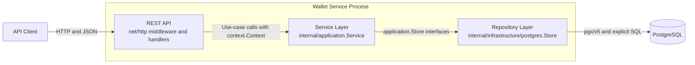
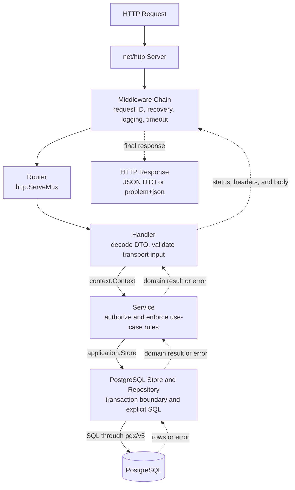
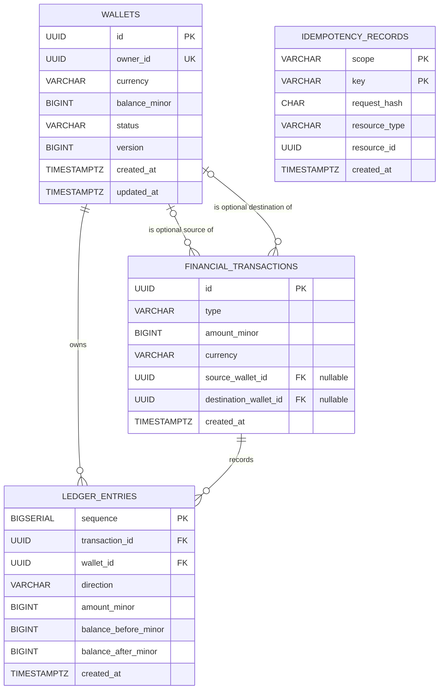
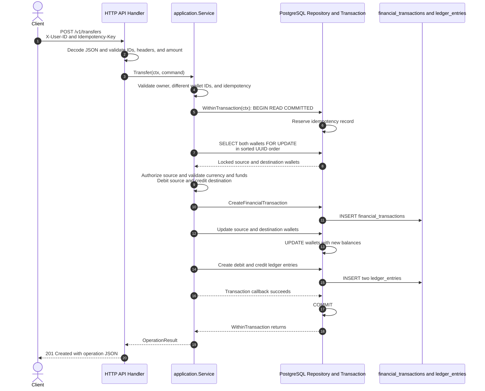
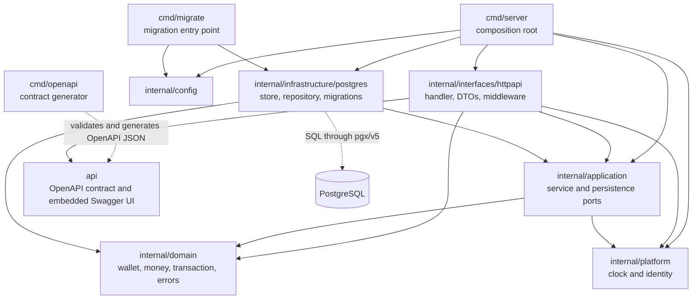
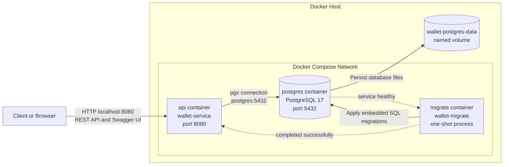

# Project Diagrams

These diagrams describe the current Wallet Service implementation. Package names, database objects, transaction behavior, and deployment relationships match the repository as implemented.

## 1. High-Level System Architecture

The HTTP adapter translates requests and errors, the application service owns use-case orchestration, and the PostgreSQL adapter implements the persistence interfaces declared by the application layer.

## 2. Request Flow

## 3. Entity Relationship Diagram

`financial_transactions.source_wallet_id` and `destination_wallet_id` both reference `wallets.id` and are nullable according to transaction type. Each committed financial operation has one or two ledger entries. The database also enforces uniqueness of `(transaction_id, wallet_id)` in `ledger_entries`.

`idempotency_records` uses the composite primary key `(scope, key)`. Its `resource_id` can identify either a wallet or a financial transaction, so the current schema intentionally does not define a foreign key for it. There is no local users table; `wallets.owner_id` stores the externally managed user UUID and has a unique constraint.

## 4. Successful Transfer Sequence

The idempotency record, both balance changes, the financial transaction, and both ledger entries commit or roll back together. Stable wallet-lock ordering prevents the common opposing-transfer deadlock cycle; retryable PostgreSQL deadlock and serialization errors are retried up to three times.

## 5. Package and Layer Dependencies

Solid arrows show compile-time package dependencies. Dashed arrows show build-time OpenAPI generation and the runtime database connection. The PostgreSQL package depends on `internal/application` because it implements the `Store` and `TransactionStore` ports declared there; the application package does not import the PostgreSQL adapter.

## 6. Local Development Deployment

Docker Compose starts PostgreSQL, runs the migration image after the database becomes healthy, and starts the API only after migration completion. The API and migration executables are built from the same project image, while PostgreSQL data persists in the named volume.
